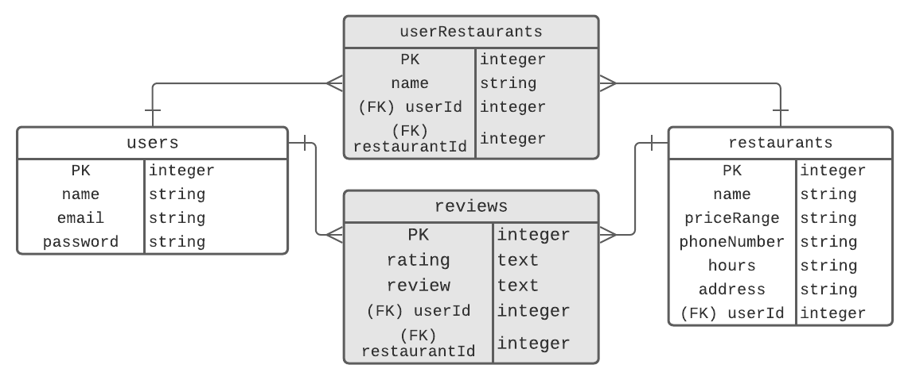

## Plant Grub
___

#### Requirements
___

* Have at least 2 models.
* Incorporate at least one API.
* Have complete RESTful routes for at least one of your resources with `GET`, `POST`, `PUT`, and `DELETE`.
* Utilize an ORM to create a database table structure and interact with your relationally-stored data.
* Include a readme file that explains how to use your app.
* Have semantically clean HTML, CSS, and back-end code.
* Be deployed online and accessible to the public.

#### Technologies Used
___
* NodeJS
* PostgreSQL
* Sequelize
* Bootstrap

#### User Stories
___
Search for plant-based dining at its finest. No matter where you live or visit, you'll find places well worth checking out with this app.
* As a user, I want to...
    * be able to search local vegetarian or vegan restaurants
    * be able to save a restaurant to my profile
    * be able to delete a restaurant from my profile
    * be able to leave a comment or rating


#### ERD<br>
___

<br>

#### Routes and Models
___

| Method | Path | Purpose |
| ------ | -------------- | -------------------------------- |
| GET | `/` | home page |
| POST | `/saved/:name` | save found restaurants |
| GET | `/profile` | save a restaurant in profile |
| GET | `/results` | shows a list of restaurants |
| POST | `/profile/comment/:id` | adds comment to user's saved restaurant |
| DELETE | `/profile` | deletes a saved restaurant |

#### API
____
Documenu is an API providing access to a database of over US 600,000 restaurants and their menus

API call
```
https://api.documenu.com/v2/restaurants/search/fields?cuisine=vegan, vegetarian&zip_code=80246
```
JSON response looks like this:
```
3:{12 items
"restaurant_name":"Garbanzo Mediterranean Fresh"
"restaurant_phone":"(303) 757-5900"
"restaurant_website":"http:///co/glendale/614531-garbanzo-mediterranean-fresh/"
"hours":""
"price_range":""
"price_range_num":0
"restaurant_id":39705341104940230
"cuisines":[1 item
0:""
]
"address":{...}5 items
"geo":{...}2 items
"menus":[]0 items
"last_updated":"2021-01-05T07:20:54.515Z"
}
```
