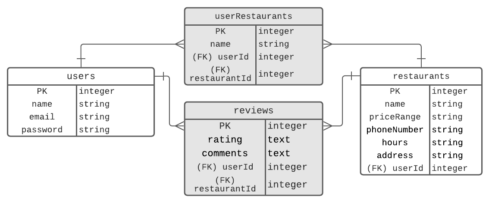

## Leggo my Veggo

#### Find your local vegan or vegetarian restaurant

#### MVP Goals
 1. Users will be able to create an account with basic information
 2. Users will be able to search local restaurants by zip code
 2. Users will be able to save or delete a restaurant
 3. Be able to leave comments or reviews on a restaurant

#### Stretch Goals
 1. Users will be able to leave a rating on a restaurant
 2. Sort results by price range

#### Tech stack
* NodeJS
* Express
* PostgreSQL
* Bootstrap

#### Wireframes


#### ERD<br>

<br>

#### CRUD RESTful Routes

| Method | Path | Purpose |
| ------ | -------------- | -------------------------------- |
| GET | `/` | home page |
| POST | `/saved/:name` | save found restaurants |
| GET | `/profile` | save a restaurant in profile |
| GET | `/results` | shows a list of restaurants |
| POST | `/profile/comment/:id` | adds comment to user's saved restaurant |
| DELETE | `/profile` | deletes a saved restaurant |

#### API
* Documenu is an API providing access to a database of over US 600,000 restaurants and their menus

```
https://api.documenu.com/v2/restaurants/search/fields?cuisine=vegan, vegetarian&zip_code=80246
```
JSON response looks like this:
```
3:{12 items
"restaurant_name":"Garbanzo Mediterranean Fresh"
"restaurant_phone":"(303) 757-5900"
"restaurant_website":"http:///co/glendale/614531-garbanzo-mediterranean-fresh/"
"hours":""
"price_range":""
"price_range_num":0
"restaurant_id":39705341104940230
"cuisines":[1 item
0:""
]
"address":{...}5 items
"geo":{...}2 items
"menus":[]0 items
"last_updated":"2021-01-05T07:20:54.515Z"
}
```
#### Potential Roadblocks
